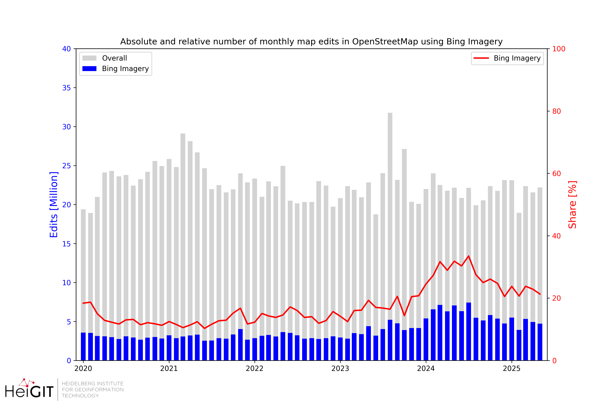
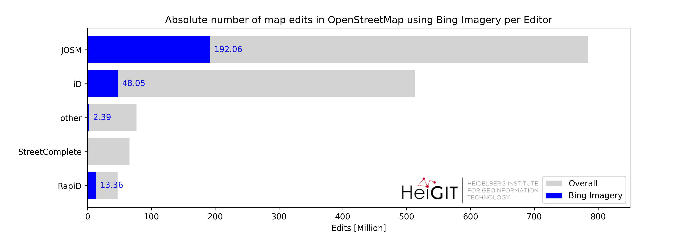
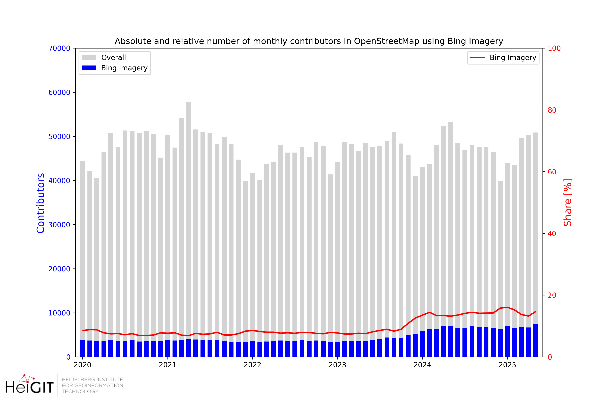

# ohsome Bing Imagery stats

This repository provides some overview statistics on the usage of Bing Aerial Imagery for mapping in OpenStreetMap (OSM).
OSM data has been processed using the [ohsome-planet tool](https://github.com/GIScience/ohsome-planet),
which transform raw OSM PBF files into GeoParquet format.

This analysis considers data from `2020-01-01` to `2025-06-15`.

Bing imagery usage is filtered based on OSM changeset tags (`source` and `imagery`).
We've used the methodology proposed by [Piet Brömmel's OSM Statistics](https://github.com/piebro/openstreetmap-statistics/blob/d86ed27a1cca36d9f2966caa16297cedd5a9015b/src/replace_rules_imagery_and_source.json#L87-L99) to filter for edits that use Bing as the background imagery.

# Map Edits
## Monthly Timeline

* As of 2025 Bing Aerial Imagery is used for about 20% of all edits in OSM
* The share of edits that use Bing Imagery has increased since beginning of 2023
* Particular high usage was observed in 2024 reaching more than 35%.
* In absolute numbers, more than 10 million map edits are supported by Bing Imagery every month.

## World Map

* Bing Imagery is used across the globe to map data in OSM.
* A particularly high absolute number of map edits using Bing Imagery was observed in US, Germany, Great Britain, but also in countries such as Nigeria, Indonesia or Brazil. This is indicated by the size of the circles in the map.
* Besides this there are many countries where Bing Imagery is the primary source for mapping. These countries which a high share of map edits using Bing Imagery are visible in the map with the darker colors.
* The table below highlights some of these countries mainly located in Africa, South-East Asia and Latin America & Caribbeans: Nigeria, Algeria, Kenya, Bangladesh, Thailand, Pakistan, Paraguay, Nicaragua

| country | country_name | bing_n_users | bing_n_users_proportion | bing_n_edits_million | bing_n_edits_proportion |
|---------|--------------|--------------|-------------------------|----------------------|-------------------------|
| GBR     | United Kingdom | 5162         | 0.13                    | 18.11                | 0.35                    |
| NGA     | Nigeria        | 1946         | 0.08                    | 10.69                | 0.49                    |
| DZA     | Algeria        | 646          | 0.15                    | 3.72                 | 0.59                    |
| KEN     | Kenya          | 2224         | 0.16                    | 3.26                 | 0.4                     |
| IRL     | Ireland        | 752          | 0.15                    | 3.14                 | 0.33                    |
| BGD     | Bangladesh     | 1186         | 0.07                    | 1.85                 | 0.32                    |
| THA     | Thailand       | 1158         | 0.12                    | 1.66                 | 0.29                    |
| PRY     | Paraguay       | 732          | 0.27                    | 1.15                 | 0.31                    |
| MOZ     | Mozambique     | 959          | 0.12                    | 1.05                 | 0.3                     |
| MLI     | Mali           | 719          | 0.14                    | 1.02                 | 0.27                    |
| LKA     | Sri Lanka      | 1418         | 0.18                    | 0.95                 | 0.34                    |
| CMR     | Cameroon       | 723          | 0.2                     | 0.93                 | 0.32                    |
| SEN     | Senegal        | 636          | 0.18                    | 0.9                  | 0.45                    |
| GHA     | Ghana          | 1254         | 0.29                    | 0.89                 | 0.36                    |
| BIH     | Bosnia & Herzegovina | 420    | 0.17                    | 0.8                  | 0.31                    |
| PAK     | Pakistan       | 795          | 0.12                    | 0.74                 | 0.25                    |
| NIC     | Nicaragua      | 333          | 0.06                    | 0.65                 | 0.52                    |
| BWA     | Botswana       | 575          | 0.05                    | 0.62                 | 0.34                    |
| TGO     | Togo           | 423          | 0.15                    | 0.58                 | 0.41                    |
| CIV     | Ivory Coast    | 480          | 0.19                    | 0.5                  | 0.34                    |
| GIN     | Guinea         | 511          | 0.25                    | 0.5                  | 0.5                     |
| LBN     | Lebanon        | 510          | 0.09                    | 0.44                 | 0.27                    |
| PRK     | North Korea    | 229          | 0.22                    | 0.4                  | 0.26                    |
| GAB     | Gabon          | 183          | 0.22                    | 0.37                 | 0.64                    |

## Editor Software

* JOSM is the OSM editor software which generates most map edits in general, but also when it comes to map edits using Bing Imagery.
* About 192 Million map edits using Bing Imagery have been made through JOSM since 2020-01-01.
* iD and RapiD follow next but with a much lower overall number of map edits. Together both account for about 60 Million map edits using Bing Imagery.

# Contributors

## Monthly Timeline

* The number of OSM contributors who have used Bing Imagery for mapping has slightly increased since 2023.
* As of 2025 about 15% of all OSM contributors rely on Bing Imagery during their mapping. This is about 6,000 - 7,000 people every month.
* In general, there are about 50,000 active OSM contributors every month.

## Editor Software

* The iD editor has by far the largest OSM contributor user base. Also, most contributors use iD when the map in OSM using Bing Imagery. However, these users perform a relatively low number of edits (see statistics above for map edits).
* Almost a third of all JOSM users has used Bing Imagery for mapping in OSM. These contributors usually perform a large number of edits.